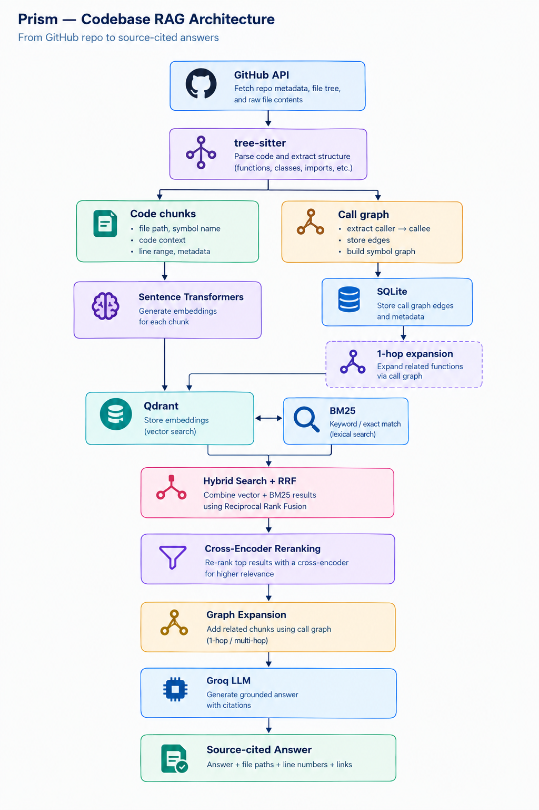

# Prism

Chat with any GitHub repository. Point Prism at a repo, and it indexes the codebase so you can ask natural-language questions about it — answers are grounded in the actual source and cited by file and line.

## How It Works

1. **Fetch** — pulls a repo's full file tree via the GitHub API
2. **Chunk** — tree-sitter does AST-aware chunking, splitting code at function and class boundaries rather than arbitrary line counts, with a line-based fallback for unsupported file types
3. **Embed** — each chunk gets a dense embedding (semantic similarity) and a sparse BM25 vector (exact keyword/identifier matches)
4. **Store** — vectors go into Qdrant, tagged by repo; a call graph (caller → callee edges) is extracted and stored in SQLite
5. **Retrieve** — a question triggers hybrid search (dense + sparse, fused via Reciprocal Rank Fusion), a cross-encoder reranks the top results for precision, then the call graph is expanded one hop to pull in related functions
6. **Generate** — Groq (`openai/gpt-oss-120b`) answers strictly from the retrieved context, with file and line citations

## Architecture



## Idempotent Re-indexing

Re-indexing a repo doesn't start from scratch or duplicate data:

- Each file's content is hashed and compared against a stored hash (SQLite `file_hashes` table) — unchanged files are skipped entirely, only new or modified files are re-chunked and re-embedded
- Chunk IDs are deterministic (derived from repo + path + line + content hash), so re-indexing unchanged code overwrites the same Qdrant point instead of creating a duplicate
- Files deleted from the repo have their chunks and call-graph edges pruned automatically

## Job Queue

Indexing runs as a background job instead of blocking the request:

- `POST /index` returns a `job_id` immediately; indexing runs asynchronously via an ARQ worker backed by Redis
- `GET /index/{job_id}` polls for status (`queued` → `in_progress` → `complete`) and returns the indexing summary on success
- A per-repo lock prevents two indexing jobs from running against the same repo at once
- Failed jobs retry automatically with exponential backoff before being marked failed

## Evaluation

A DeepEval-based pipeline scores answer quality against a small set of test questions (currently targeting `pallets/flask`), using Groq as the LLM judge across four metrics: Faithfulness, Answer Relevancy, Contextual Precision, and Contextual Recall. Each result also checks whether the expected source chunk was actually retrieved.

## Tech Stack

| Layer | Technology |
|---|---|
| API Server | FastAPI |
| Job Queue | ARQ + Redis |
| Vector DB | Qdrant |
| Dense Embeddings | `sentence-transformers` (`all-MiniLM-L6-v2`) |
| Sparse Search | BM25 |
| Re-ranking | Cross-encoder |
| AST Parsing | tree-sitter |
| LLM (generation + eval judge) | Groq (`openai/gpt-oss-120b`) |
| Evaluation | DeepEval |
| Call Graph Storage | SQLite |
| Frontend | React + Vite + Tailwind CSS |

## Project Structure

```
Prism/
├── api/              # FastAPI app and routes (/index, /index/{job_id}, /ask)
├── ingestion/         # GitHub repo fetching
├── embeddings/        # Dense + sparse embedding generation
├── storage/           # Qdrant client, chunk storage, full indexing pipeline
├── graph/              # tree-sitter call extraction, SQLite call-graph + file-hash storage
├── retrieval/          # Hybrid search + reranking
├── generation/         # Prompt building and Groq-based answer generation
├── jobs/               # ARQ worker and background job definitions
├── eval/               # DeepEval pipeline, Groq judge wrapper, test cases
├── prism-ui/           # React + Vite + Tailwind frontend
├── symbol_graph.db     # SQLite database (call graph + file hashes)
└── requirements.txt
```

## Setup

### Backend

```bash
git clone https://github.com/PranaliPathak04/Prism.git
cd Prism
python -m venv venv
venv\Scripts\activate          # Windows
pip install -r requirements.txt
```

Start Qdrant and Redis (each in its own Docker container):

```bash
docker run -d -p 6333:6333 --name qdrant-prism qdrant/qdrant
docker run -d -p 6379:6379 --name redis-prism redis
```

Create a `.env` file:

```env
GITHUB_TOKEN=ghp_your_token_here   # raises GitHub's API rate limit from 60/hr to 5,000/hr
GROQ_API_KEY=gsk_your_key_here
```

Run the API and the background worker in separate terminals:

```bash
uvicorn api.main:app --reload
arq jobs.worker.WorkerSettings
```

### Frontend

```bash
cd prism-ui
npm install
npm run dev
```

## API

| Method | Route | Description |
|---|---|---|
| `POST` | `/index` | Start indexing a repo (`owner`, `repo`, `branch`); returns a `job_id` |
| `GET` | `/index/{job_id}` | Poll indexing job status and result |
| `POST` | `/ask` | Ask a question about an indexed repo; returns an answer with source citations |

## Design Decisions & Lessons Learned

A few non-obvious choices worth knowing if you extend this:

- **Decorator unwrapping in chunking** — tree-sitter represents `@decorator def foo():` as a `decorated_definition` node wrapping a `function_definition`, not as a plain function node. Missing this silently drops most real-world Python methods (anything decorated) from chunking entirely.
- **Class docstrings are truncated to one line** when prepended to method chunks — including the full docstring in every method's chunk diluted embeddings and wasted tokens.
- **Hybrid search alone wasn't enough** — RRF fusion of dense + sparse still didn't reliably surface the correct chunk for narrow technical questions; cross-encoder reranking was what actually fixed precision.
- **The call graph is approximate, not fully resolved** — it matches callee names as bare strings without type resolution, so generic method names (`get`, `set`) can produce false-positive edges across unrelated classes. A known limitation, not a bug.
- **Deterministic chunk IDs instead of `force_recreate`** — chunk IDs are derived from repo + path + line + content hash, so re-indexing unchanged code overwrites the same Qdrant point rather than requiring the whole collection to be wiped and rebuilt on every run.

## Status

- ✅ Core pipeline (fetch → chunk → embed → retrieve → generate)
- ✅ Idempotent, per-file incremental re-indexing
- ✅ Background job queue with retries and status polling
- 🔄 Evaluation pipeline built; currently rate-limited on Groq's free tier
- 🔄 Frontend in progress